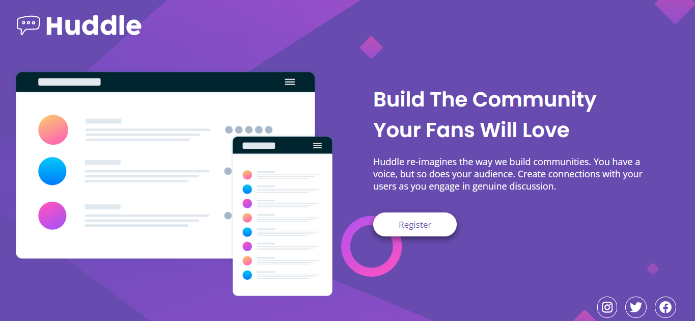
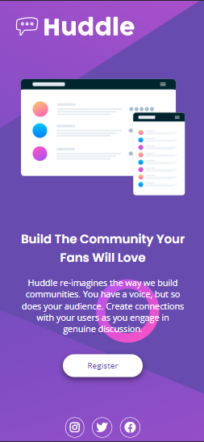

# Frontend Mentor - Huddle landing page with single introductory section

## Desafio

Este, é o desafio proposto pelo curso DevQuest. O único requisito é:

- Use os conhecimentos que aprendeu nos módulos de HTML avançado e CSS avançado para resolvê-lo da melhor forma.

- Aplicar a responsividade para desktop (1140px) e mobile (425px)

### Responsividade

Versão desktop:

### Dificuldades

- Imagem de background centralizada.

- Ícones das redes sociais no canto da base da tela